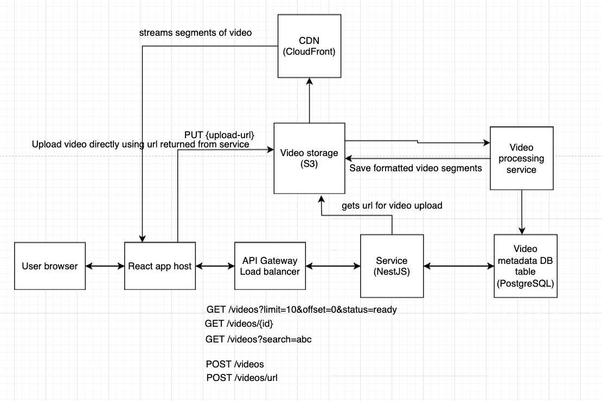

# Video streaming (YouTube clone) - System design

## Overview

This is a document describing the system design of simplified video shareing and streaming platform. Designed to support 20k–50k Daily Active Users in Canada and Europe.

## Functional Requirements

- Upload video (3% of users are uploaders)
- View list of videos with thumbnails and titles
- Watch videos (every user watches 5 videos daily)

## Non-Functional Reqruirements

**Estimated traffic**

Video viewing
per user/day

- 2 page loads -> 2 API calls
- 5 videos watched -> 2 API calls per video = 10 API calls

total per user = 2 + 10 = 12 API calls per user/day
for 50000 users = 12 \* 50,000 = 600,000 requests/day

Storage estimate for videos
Assuming that around 3% of users are uploaders and they upload 1 video per day. Average video size is 100 MB

50,000 _ 3% _ 100MB = 150GB/day

**Scalability**

- should support 50,000 DAU
- backend services should scale horizontally
- scalable video storage and delivery

**Availability, Reliability**

- Should be highly available with minimal downtime
- Backend and DB should be deplyed to multiple Availability Zones
- Should handle failover for video storage and delivery
- Should be able to recover from processing failures with error handling, retries, logging.

**Performance**

- API responses should return within 300ms
- Video list should load withtin 2s under typical conditions
- Video should start within 2s
- Video processing/transcoding should be under 3min for a standard video (~5min)

**Security**

- all data and traffic must be served over HTTPS
- Authentication should use JWT
- Backend has to validate input and protect against XSS, CSRF and SQL injection

**Maintainability**

- Code should be modular and organized
- Code should be reviewed and approved
- Code should be covered with unit, integration, end-to-end tests
- API should follow REST conventions and versioning for backward compatibility
- The system must support easy addition of the new features
- Infrastructure should use Infrastructure as Code (CDK)
- Automate testing and deployemnets with CI/CD pipelines
- System should include centralized logging (CloudWatch, Sentry)

**Localization**

- User content should support multiple locales
- Dates should use UTC in storage for easy convetion when displayed.

**Compliance**

The system must follow GDPR

- delete user data on demand
- must have privacy policy page
- must ask for consent if storing personal information

## System architecture

1. User browses and views videos

- User opens an app
- User can see the paginated or scrollable video cards
- User can click to play a video
  - React app makes a request GET /videos?limit=10
  - Backend handles the request, calls DB to fetch video list, returns latest 10 videos
  - React frontend renders the cards
- User clicks on the video
  - Frontend fetches video metadata with GET /videos/{id}
  - Backend returns video metadata, including id, title, description, video url, duration, user id and user name, views, tags...
  - Use react player to stream the video from the CloudFront CDN

2. User uploads the video

- React app calls API to get an upload URL POST /videos/url
- Backend validates input and returns S3 pre-signed URL
- React app sends a PUT request directly to S3 to upload the video
- Once upload is done, React app calls POST /videos
- Backend stores video metadata to PostgreSQL and triggers
- S3 notifies video processing service (ObjectCreated even)
- Processing service pulls the raw file from S3, divides video into segments and transcodes them into different formats.
- Saves the processed video back to S3
- Updated video metadata in DB (updates processed url and status to ready)

## Tech Stack

The stack was chosen to for production readiness, to allow fast delivery and the ability to scale.

**Frontend**
React + Vite - industry standard for SPAs, bundle optimization, fast dev server, minimal learning curve
Tailwind CSS or company design library - for rapid UI development and consistent styling
React Router - routing management
react-player - video player
Vercel - frontend hosting with CDN and out of the box deployment pipeline

**Backend**
NestJS - modular, scalable framework with Typescript, supports clean MVC design pattern, familiar to the team

**Database**
PostgreSQL on AWS RDS - Reliable relational DB, ideal for stractured related data like videos, users, favorites. Multi AZ RDS will allow autmated failover and will be highly available

**Storage**
S3 - scalable, durable object storage for raw and processed video files. Pre-signed URLs allow direct uploads from the client. Can be cost optimized with automatic transition of old content to Glacier.

**Video Processing**
FFmpeg on ECS - open source video transcoding tool, with thumbnail generation and format convertion.
SQS queue - job queue to decouple video processing workload from direct API traffic

**Infrastructure**
CloudFront - Global CDN for the fast delivery to the users located in different regions (Canada, Europe).
API Gateway - centralized entry, handles authorization, validates request, applies CORS rules and rate limiting, forwards to the ALB.
ALB - routes traffic to the ECS
